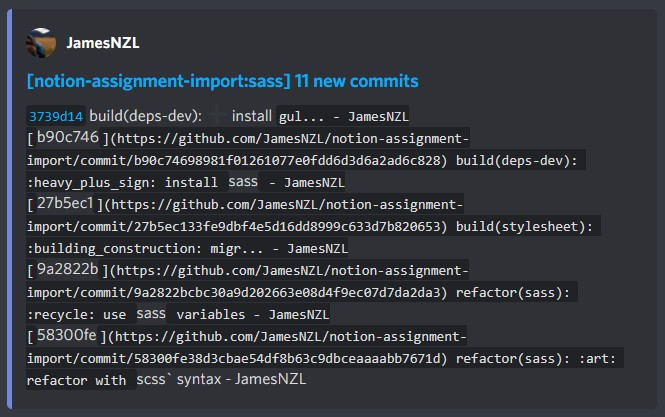
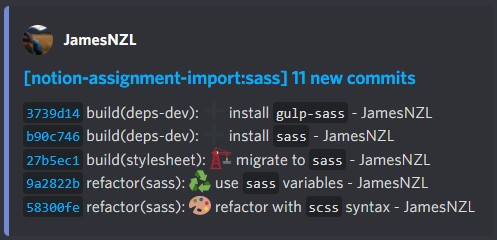

## GitHub–Discord Webhook Proxy

This is a proxy to sit between GitHub and Discord, built with [Next.js](https://nextjs.org/) API routes.

Discord truncates commit messages to a constant length of `50` characters, which often cuts off closing backticks in commit messages.
> In my testing, this **does not depend on username length**.

Currently, this proxy applies the following transformations to commit messages:
1. Ensures all inline code blocks <code>`</code> are correctly truncated and closed.
2. Resolves recognised [gitmoji](https://github.com/carloscuesta/gitmoji/blob/master/src/data/gitmojis.json) codes (eg `:technologist:`) to their emoji characters (eg 👨‍💻).
	> Discord does their message truncation calculations before any gitmoji codes in the commit message are resolved.  
	> This means gitmoji codes often result in lots of wasted space, as only the emoji is rendered in the resultant embed.

All transformations are fully unit tested with [Vitest](https://vitest.dev/). See the test files in [`lib/`](lib/), and run the test suites with `npm run test`.

### Before


### After


## Usage

See [Deploy on Vercel](#deploy-on-vercel) if you want to deploy your own proxy instance.

If you'd like to use my instance, simply configure your GitHub webhook URL to `github.jamesnzl.xyz/api/github/webhook?webhook_url=<DISCORD WEBHOOK URL>`.

## Running Locally

First, run the development server:

```bash
npm run dev
# or
yarn dev
```

Once the server is started, use a service such as [Ngrok](https://ngrok.com/) to expose your localhost for testing.

## Deploy on Vercel

The easiest way to deploy your Next.js app is to use the [Vercel Platform](https://vercel.com/new?utm_medium=default-template&filter=next.js&utm_source=create-next-app&utm_campaign=create-next-app-readme) from the creators of Next.js.

Check out our [Next.js deployment documentation](https://nextjs.org/docs/deployment) for more details.

## Licence

The source code of this repository is licensed under MIT.
